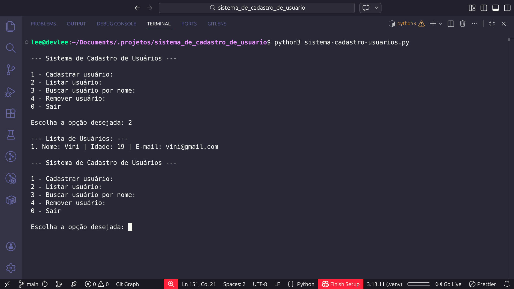
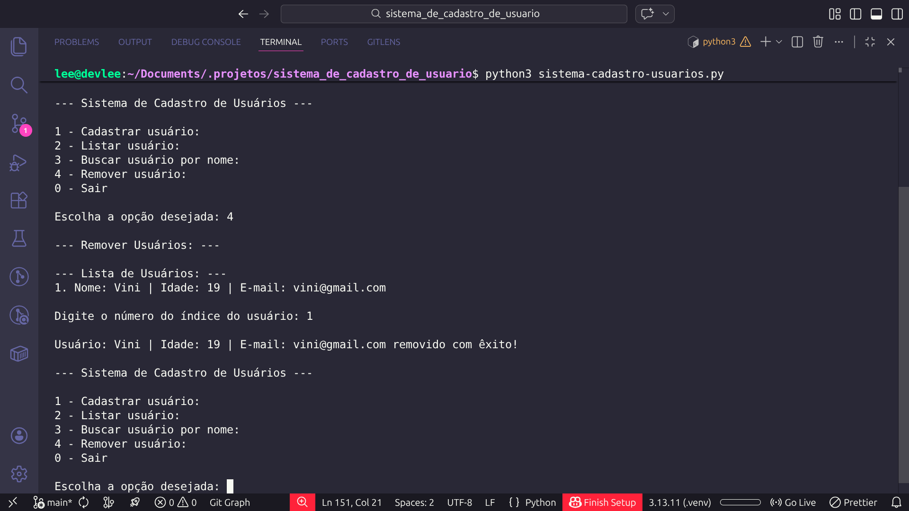

# 👤 Sistema de Cadastro de Usuários (CRUD - CLI)

Projeto desenvolvido em **Python**, com persistência de dados em **JSON**, implementando operações fundamentais de um sistema CRUD em ambiente de linha de comando (CLI).

O objetivo deste projeto é aplicar lógica de programação, manipulação de dados estruturados e boas práticas de organização de código, simulando o funcionamento de um sistema real de cadastro.

---

## 📸 Preview do Projeto

<p align="center">
  
  
</p>

---

## 🚀 Funcionalidades

- Carregamento automático de usuários via arquivo JSON
- Cadastro de novos usuários
- Listagem completa de usuários cadastrados
- Busca por nome ou parte do nome
- Remoção de usuários
- Persistência automática após alterações
- Tratamento de exceções para entradas inválidas
- Estrutura modular com funções organizadas

## 🧠 Conceitos Aplicados

- Estruturas de dados (listas e dicionários)
- Manipulação de arquivos JSON
- Persistência de dados
- Tratamento de exceções (try/except)
- Modularização de funções
- Versionamento com Git

Organização de projeto em diretórios

## 📂 Estrutura do Projeto

```bash
📁 sistema_de_cadastro_de_usuario/
│
├── assets/
│   ├── preview.png
│   └── preview-remove-user.png
│
├── dados/
│   └── usuarios.json
│
├── .gitignore
├── LICENSE
├── README.md
├── requirements.txt
└── sistema-cadastro-usuarios.py

```

---

## 💻 Como Clonar e Executar o Projeto

### 1️⃣ Clonar o Repositório

Abra o terminal e execute:

```bash
git clone https://github.com/thevinisantos/sistema_de_cadastro_de_usuario.git
```

### 2️⃣ Acessar a Pasta do Projeto

Acessar pasta do projeto:

```bash
cd sistema_de_cadastro_de_usuario
```

### 3️⃣ Executar o projeto

Certifique-se de ter o **Python** instalado em sua máquina.

**Linux/macOS:**

```bash
python3 sistema-cadastro-usuarios.py
```

**Windows:**

```bash
python sistema-cadastro-usuarios.py
```

Observação: Caso o arquivo **dados/usuarios.json** não exista, ele será criado automaticamente durante a execução do sistema.

---

## 🔄 Melhorias Futuras

- Refatoração
- Implementação da funcionalidade de atualização (Update)
- Aplicação de Programação Orientada a Objetos (OOP)
- Transformação do sistema em API REST (FastAPI)

---

## 📄 Licença

Este projeto está sob a licença MIT.  
Consulte o arquivo [LICENSE](LICENSE) para mais informações.
